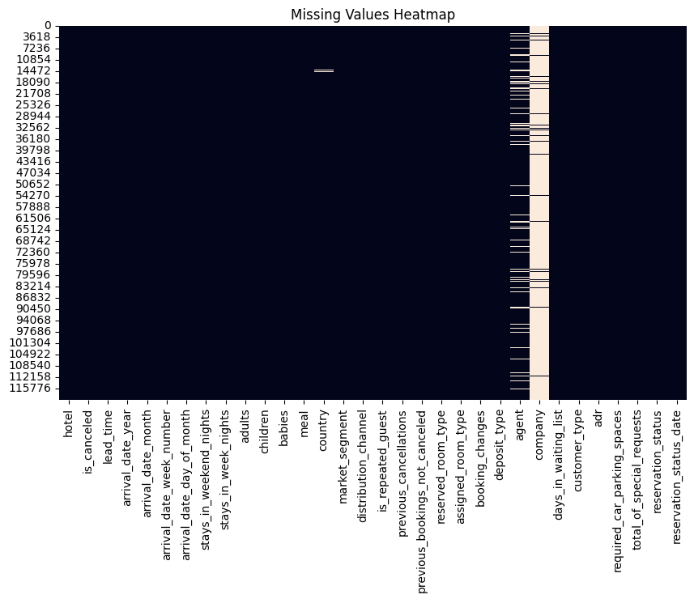

# Hotel Booking Data Cleaning Project

## 🚀 Overview

A complete data cleaning pipeline for the [Hotel Booking Demand Dataset](https://www.kaggle.com/datasets/lessemostipak/hotel-booking-demand), covering:

- Missing value imputation
- Outlier detection (IQR/z-score)
- Duplicate removal
- Data validation

## 📊 Results

| **Metric**     | Before Cleaning | After Cleaning |
| -------------- | --------------- | -------------- |
| Missing Values | 129,425         | 0              |
| Duplicates     | 32              | 0              |
| Outliers (ADR) | 1,247           | 0              |

**Key Visualizations**:  


## 🛠️ Usage

1. Clone the repo:
   ```bash
   git clone https://github.com/your-username/hotel-booking-data-cleaning.git
   ```
2. Run the notebook:
   ```bash
   jupyter notebook notebooks/Hotel_Booking_Data_Cleaning.ipynb
   ```

## 🔧 Dependencies

- Python 3.7+
- pandas, numpy, matplotlib, seaborn
